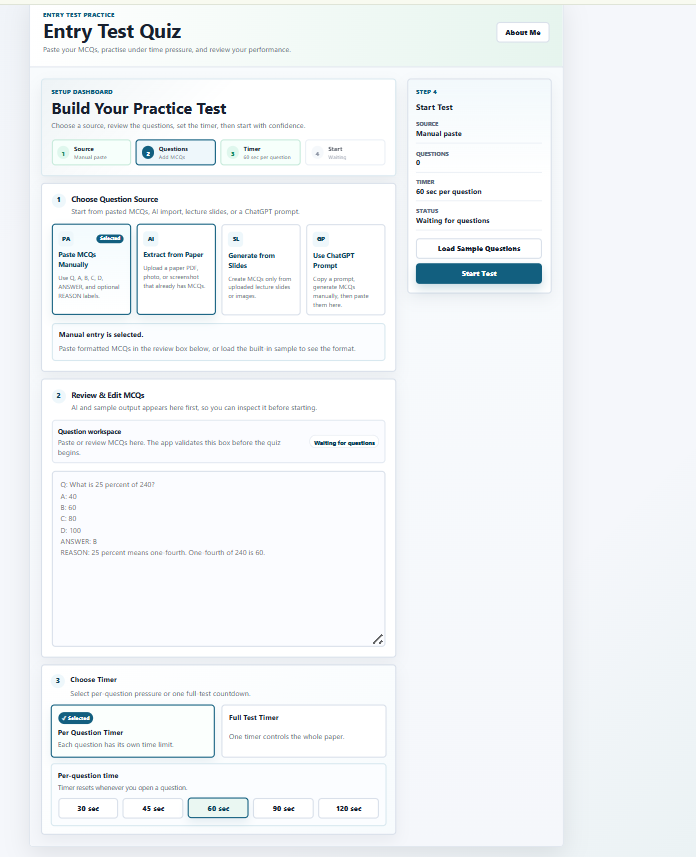

# Entry Test Quiz

A professional, responsive quiz practice app for university entry-test MCQs. It helps students create practice tests from pasted questions, papers, images, or lecture slides, then attempt them under realistic timing and review mistakes with clear feedback.

**Live Demo:** [https://quiz-test-app-five.vercel.app/](https://quiz-test-app-five.vercel.app/)



---

## Overview

Entry Test Quiz is built for students preparing for university admission and scholarship tests such as HAT, NTS, GAT, FAST, NUST, COMSATS, and similar entry exams.

The app keeps the core quiz experience simple: add MCQs, choose a timer mode, start the test, answer questions, review results, and retry weak areas. It also includes optional AI tools to convert rough study material into quiz-ready MCQs.

Normal quiz practice works without an API key. AI features require a Gemini API key.

---

## Key Features

### Dashboard Setup Flow

- Clean step-based dashboard for building a practice test.
- Source selection, question review, timer setup, and start summary.
- Professional responsive layout for desktop and mobile.
- About Me creator profile section.

### Question Input and Formatting

- Paste MCQs manually in a simple format.
- Parser validation with clear errors before starting.
- Supports optional `REASON:` or `EXPLANATION:` labels.
- Supports multiline explanations.
- Auto Format MCQs tool for messy copied text.
- ChatGPT prompt helper for generating correctly formatted MCQs.

### AI Import Tools

- Extract MCQs from paper PDFs.
- Extract MCQs from paper photos or screenshots.
- Generate MCQs from lecture slides or lecture images.
- Uses Gemini through private Vercel API routes.
- AI output is inserted into the textarea first so users can review and edit before starting.

### Quiz Experience

- One-question-at-a-time quiz flow.
- Per Question Timer mode:
  - 30 sec
  - 45 sec
  - 60 sec
  - 90 sec
  - 120 sec
- Full Test Timer mode:
  - 5 min
  - 10 min
  - 15 min
  - 30 min
  - 45 min
  - 60 min
  - Custom minutes
- Final warning state when time is almost over.
- Save selected answers immediately.
- Allow changing answers before moving forward.
- Skip questions and revisit them later.
- Question palette with answered, skipped, current, and not-attempted states.
- Finish test confirmation.
- Refresh recovery using `localStorage`.

### Results and Review

- Shows total questions, correct, wrong, unanswered, and percentage score.
- Review filters:
  - All Questions
  - Correct
  - Incorrect
  - Not Attempted
- Shows selected answer, correct answer, status badge, time spent, and explanation.
- Retry wrong and unanswered questions.
- AI Tutor chatbot for hints, step-by-step help, answer verification, and short explanations.

---

## MCQ Format

Paste MCQs in this format:

```text
Q: What is 25 percent of 240?
A: 40
B: 60
C: 80
D: 100
ANSWER: B
REASON: 25 percent means one-fourth. One-fourth of 240 is 60.
```

Multiple questions should be separated by a blank line.

`REASON:` and `EXPLANATION:` are optional. Questions without explanations still work.

The parser accepts uppercase or lowercase labels and ignores extra spaces around labels.

---

## AI Features

AI tools are optional. The normal quiz flow works without any API key.

AI-powered features include:

- Paper PDF/image to MCQs
- Lecture slides to MCQs
- Auto Format MCQs
- AI Tutor chatbot

These features use Gemini through serverless API routes, so the API key is not exposed in the browser.

### Environment Variables

Create a local `.env` or `.env.local` file:

```env
GEMINI_API_KEY=your_gemini_api_key_here
GEMINI_MODEL=gemini-3.5-flash
```

`GEMINI_MODEL` is optional. The project currently uses `gemini-3.5-flash` as the default model setting.

The same values are shown in `.env.example`.

---

## Tech Stack

| Area | Technology |
| --- | --- |
| Frontend | React |
| Language | TypeScript |
| Build Tool | Vite |
| Styling | CSS |
| PDF Processing | pdfjs-dist |
| AI Provider | Gemini API |
| Deployment | Vercel |
| Recovery Storage | localStorage |

---

## Local Setup

Install dependencies:

```bash
npm install
```

Run the frontend with Vite:

```bash
npm run dev
```

For AI serverless routes locally, run with Vercel:

```bash
npx vercel dev
```

Build for production:

```bash
npm run build
```

Preview the production build:

```bash
npm run preview
```

---

## Deployment

The app is deployed on Vercel:

[https://quiz-test-app-five.vercel.app/](https://quiz-test-app-five.vercel.app/)

For AI features on Vercel:

1. Open the Vercel project.
2. Go to **Settings** -> **Environment Variables**.
3. Add:

```env
GEMINI_API_KEY=your_gemini_api_key_here
GEMINI_MODEL=gemini-3.5-flash
```

4. Redeploy the project.

The browser never sees the key. Only the Vercel API routes use it.

---

## Project Structure

```text
.
|-- api/
|   |-- extract-mcqs.ts
|   |-- format-mcqs.ts
|   `-- tutor-chat.ts
|-- src/
|   |-- App.css
|   |-- App.tsx
|   |-- asim-profile.png
|   |-- image.png
|   |-- index.css
|   |-- main.tsx
|   `-- vite-env.d.ts
|-- .env.example
|-- .gitignore
|-- index.html
|-- package.json
|-- package-lock.json
|-- README.md
|-- tsconfig.json
|-- tsconfig.node.json
`-- vite.config.ts
```

---

## What Was Built

This project includes a complete practice-test workflow:

1. A dashboard-style setup screen.
2. Manual MCQ paste and validation.
3. AI-assisted MCQ extraction and generation.
4. Timer modes for both per-question and full-test practice.
5. Skip and question palette navigation.
6. Saved answers and refresh recovery.
7. Detailed results and review tabs.
8. Retry flow for weak questions.
9. AI Tutor support for learning from mistakes.
10. Creator profile and polished responsive UI.

---

## Author

**Muhammad Asim Ilyas**

Creator of Entry Test Quiz, a student-focused practice tool designed to make MCQ preparation easier, faster, and more organized.

---

## Notes

- No login is required.
- No database is used.
- Manual quiz practice works locally without AI setup.
- AI tools require `GEMINI_API_KEY`.
- Saved quiz progress is stored in the browser through `localStorage`.
- Clearing browser storage removes saved quiz progress.
